## 产品简介

思通数科利用自然语言处理技术，让计算机具备对网页、文件、文本、声音、图像的阅读能力，帮助客户自动化处理海量文本数据，打造一系列NLP技术工具集或场景化方案，提升文字处理效率和文本挖掘深度，降低人工成本。

同时可做到定制化，本地部署、低成本、接入快速、将网页、文件、文本、声音、图像中的文本进行结构化的处理，支持通过文本挖掘技术实现内容标签提取、文本自动分类等功能，全方位构建企业级数据库与内容画像。

 

## 产品试用
接口地址：[https://s1.stonedt.com:5337](https://s1.stonedt.com:5337/dist/index.html)  
SecretId: ad0b5518-80e9-4d61-a640-165e340289ba  
SecretKey: 10dd203acf748186f18c8583ff1aa43a

 

## 接口文档

[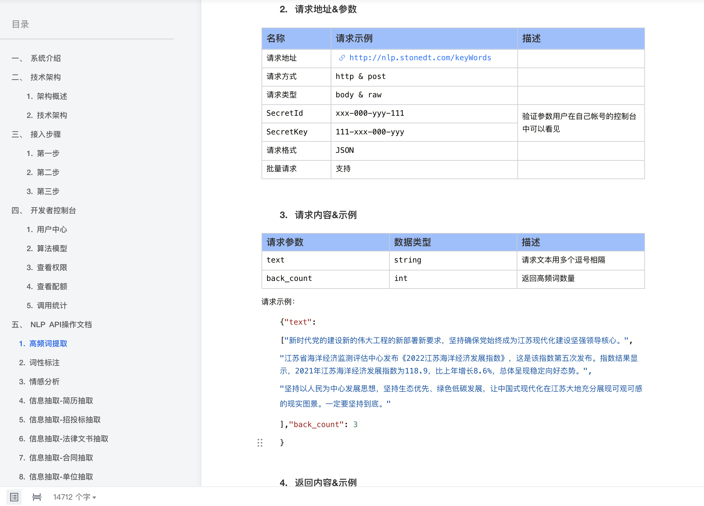](https://docs.qq.com/doc/DQU5yQU92aW1jWWJ4)

##### 文档地址
https://docs.qq.com/doc/DQU5yQU92aW1jWWJ4

 

## 功能清单

##### 功能列表

https://docs.qq.com/sheet/DQWRvaUJ0R2FGcFVu?tab=hienxw

 

## 功能介绍

##### 系统首页

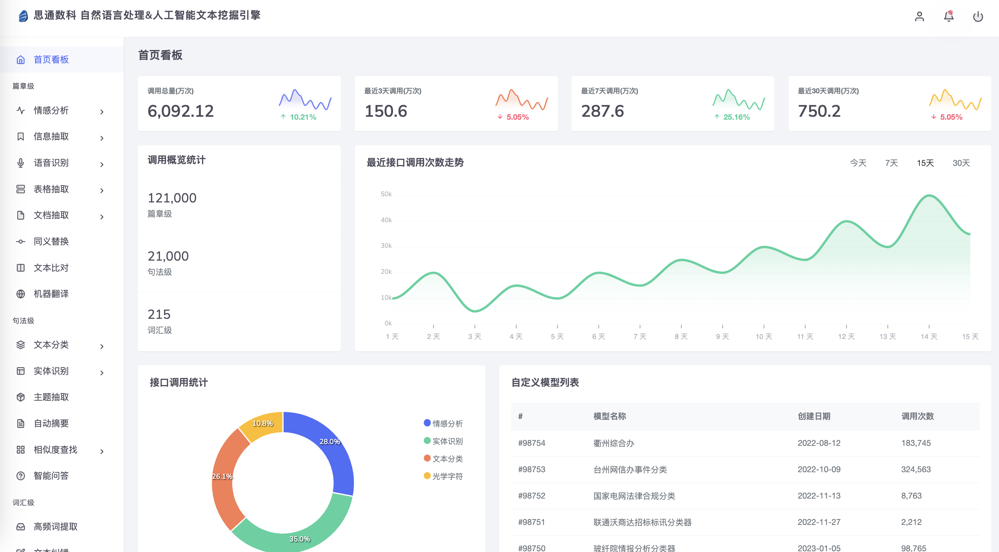

##### 高频词分析

##### 情感分析

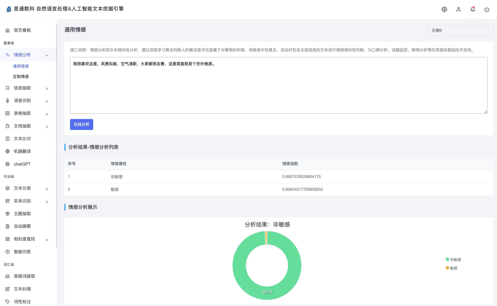

##### 实体识别

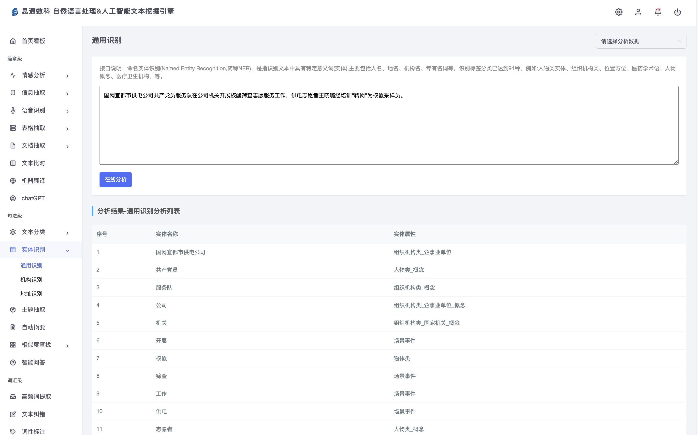

##### 文本分类

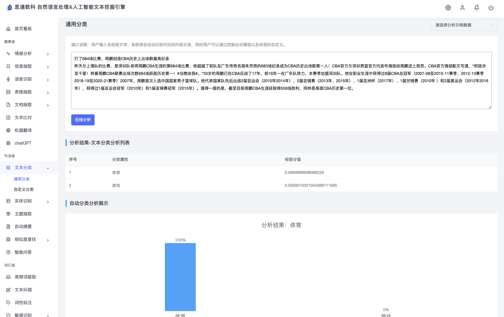

##### 文本纠错

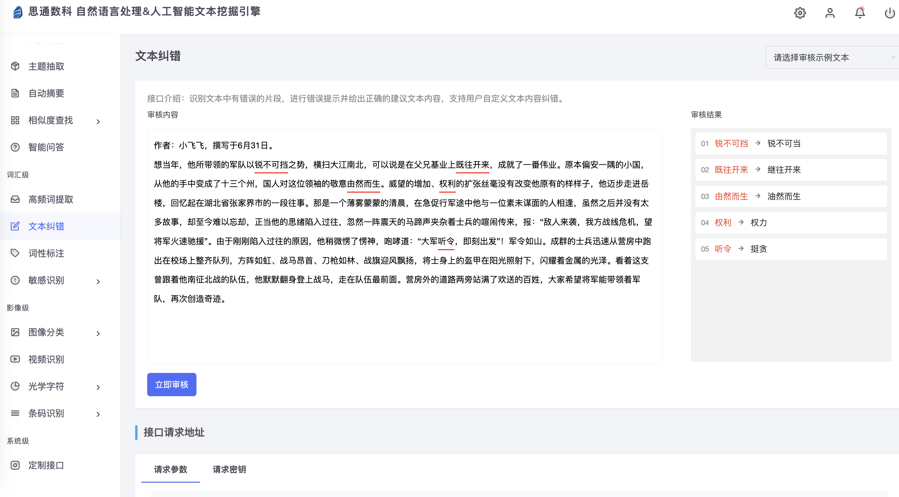

##### 语音识别
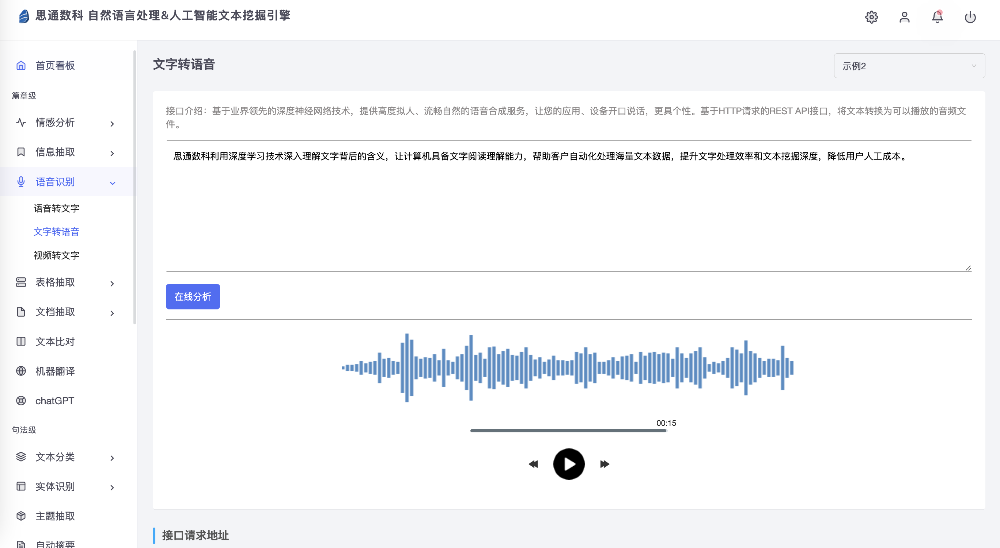

##### 视频转文字

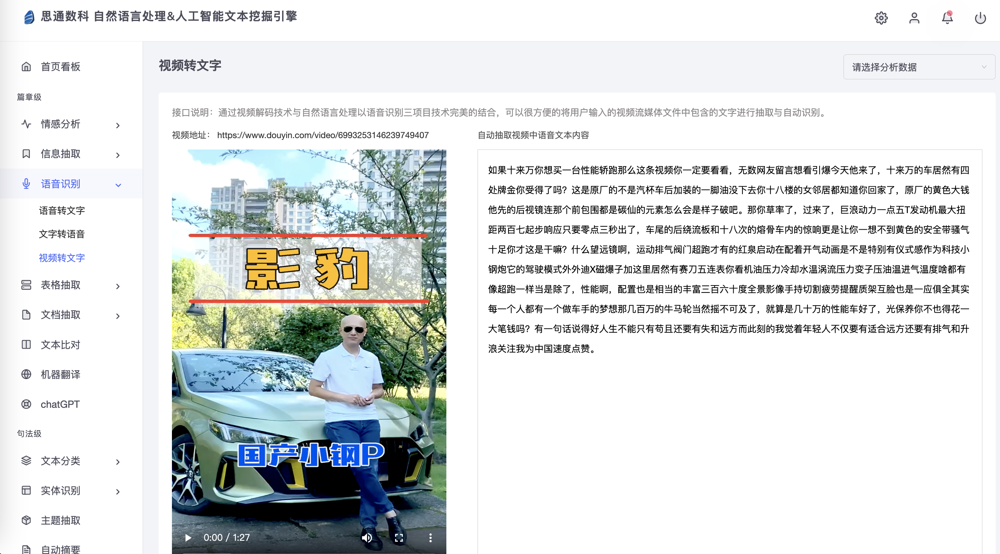

##### 文本分类 (自定义分类)

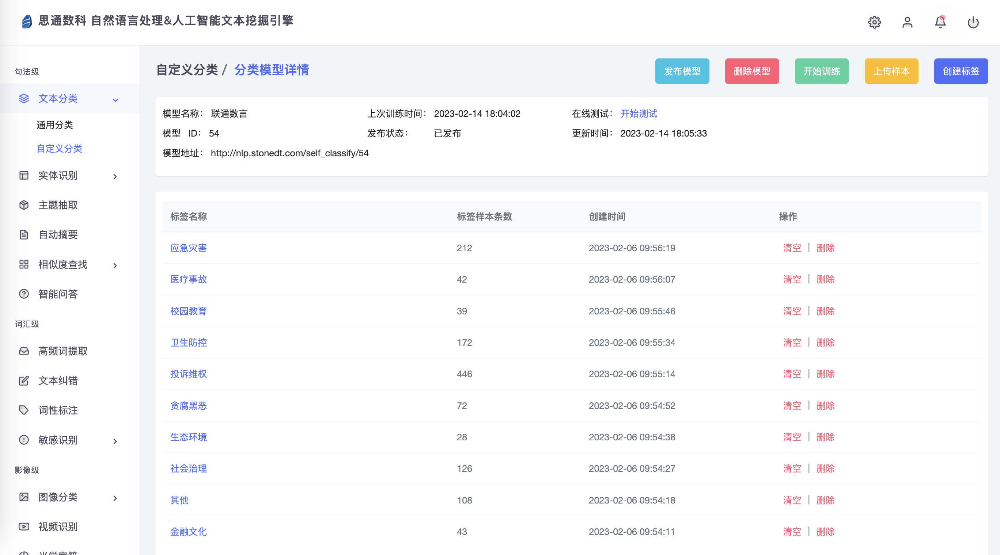

##### OCR识别

##### 验证码识别

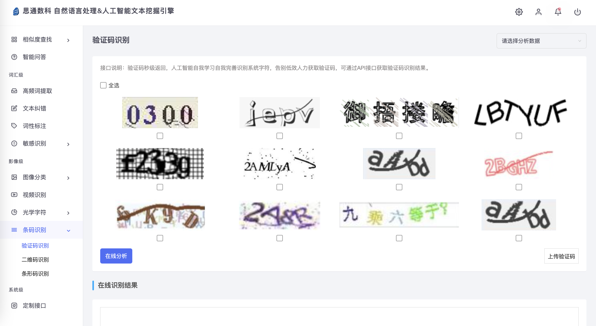

##### 图像分类

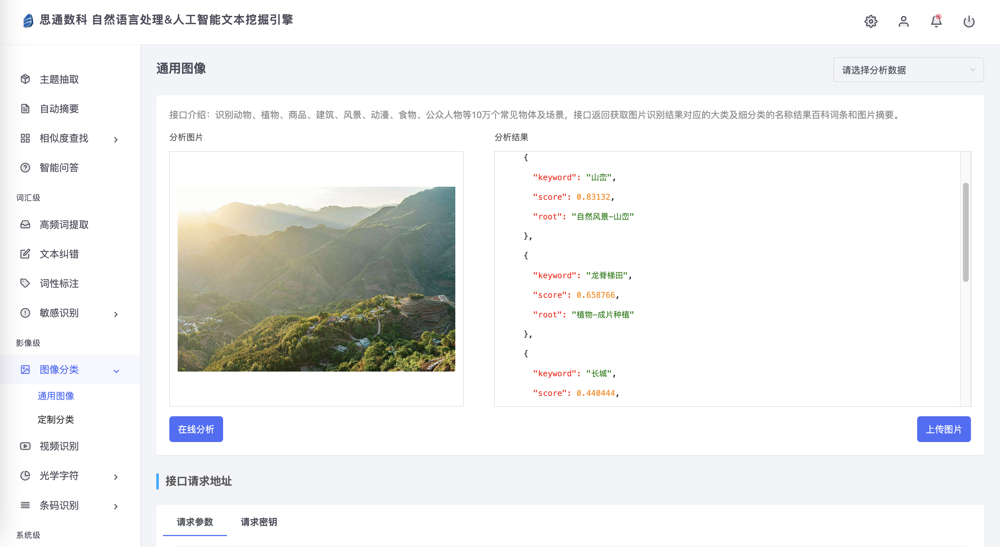

##### 智能问答

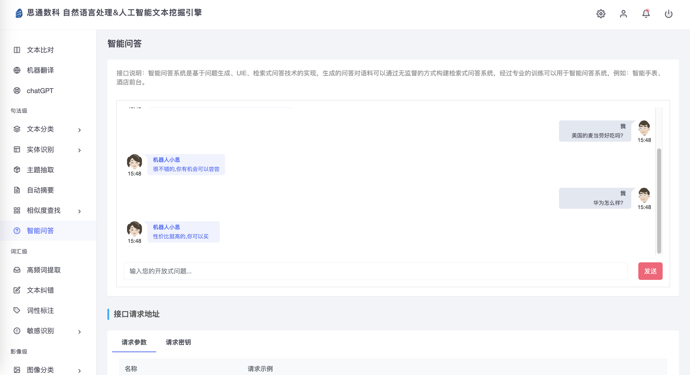

##### 系统词典管理

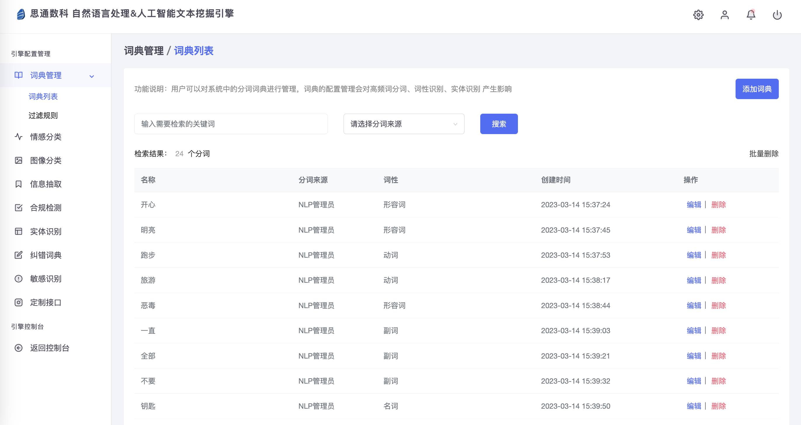

##### 情感分析标注

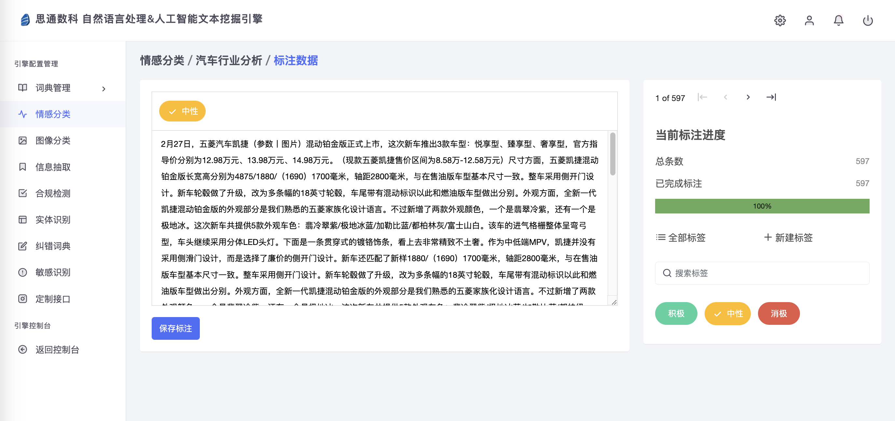

##### 图像分类标注

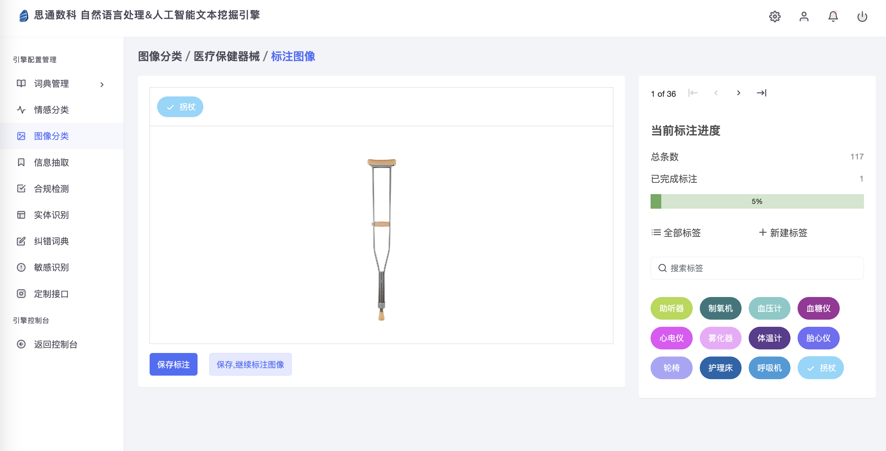

##### 信息抽取标注

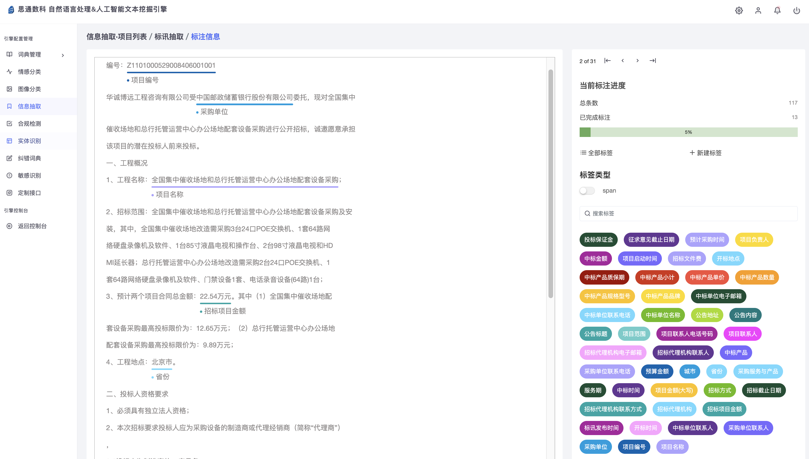

##### 观点抽取标注

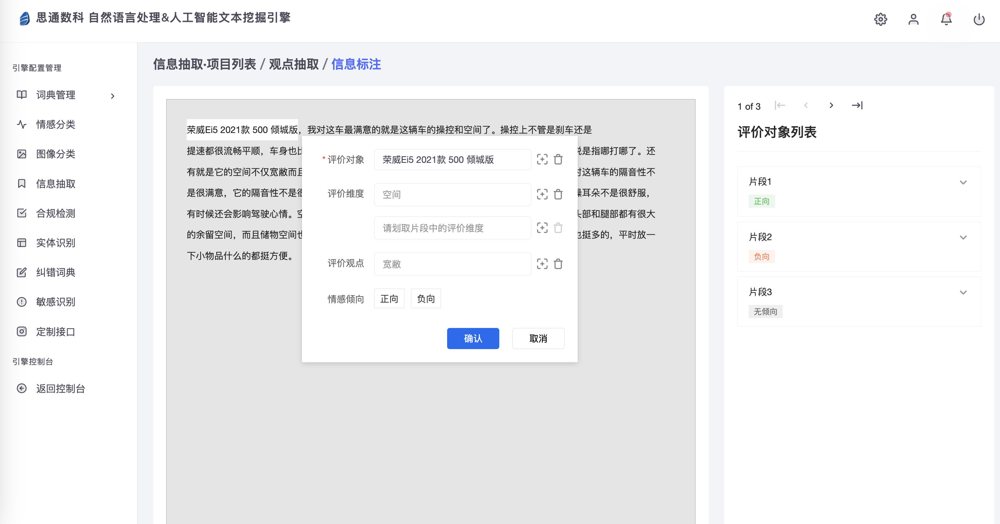

 

## 应用场景

##### 1）自动结构化数据

应用于深度挖掘文本、音视频、图像、办公文件中的高频词、人物、价格、甲乙方、指标参数、时间、地名、企业名称、专有名词、主题、热点、话题、正负面情感等，自动对其打上数据标签等功能，将企业原有历史沉淀海量无序的内容结构化处理，实现更精准的检索、分类、搜索、推荐能力。系统标签覆盖上百个大类、过万个小类，通用场景主题标签600+，行业关键词标签百万级。同时提供模型训练工具，边标边训练可进一步降低成本。

##### 2）文档智能比对

依托OCR、自然语言处理、知识图谱等技术，在合同处理场景提供交易签订、合同审查、合同归档管理等应用服务；目前支持扫描件、Word、PDF等多种文档格式，能自动抽取文档的关键信息、对比文档之间的差异、审核文档潜在风险、识别提取文档中的表格。现已广泛应用于金融、制造、通信、法律、审计、媒体、银行、政府等多种文字密集型行业，赋能企业文档流程化、自动化、智能化处理。

##### 3）内容合规审核

支持涉黄、涉政、暴恐、辱骂、广告、灌水以及自定义合规审核，运用接视频解码、自然语言处理、图像识别、语音识别、标点恢复等多项目技术完美的结合，可以很方便的将网页、文件、文本、声音、图像中的文本内进行抽取与自动识别。采用线上大量无监督训练语料，对文本内容进行安全分类。支持用户自定义标签提供训练、评估工具，可快速完成模型的调研和训练。

##### 4）人岗精准匹配

基于大数据及机器学习建模。自动快速，抽取候选人信息，对企业用户的筛选要求进行深层理解，给企业HR推送合适的候选人。并对简历进行关键信息提取，构建人才画像，匹配精准岗位，协助HR完成招聘流程，提升工作效率。

##### 5）热线电话分析

针对政府、企业等热线电话场景，提供语音数据做智能降噪，并借助NLP多种技术能力组合，实现表单填写、信息检索、工单分类等任务，形成有效对话文本，并且自动填写表单，实时推荐工作人员问题的答案、检索结果，强化客服人员处理能力，提升用户满意度。

##### 6）地址自动修复

精准提取文本中缺失地址信息以及抽取特征性的地址信息，并按省、市、区、街道、详细地址的格式结构化输出，通过自然语言处理辅助地址识别，生成标准规范的结构化信息，大幅提升辖区内政府、公安、执法、企业效率。

##### 7）评论观点抽取

将网络评论、商品评价、客服电话中的信息快速建立正负面评论观点，针对企业服务或产品的用户评论场景，帮助企业精准、全面地理解用户想法，快速构建基于评论的数据分析系统，提供自动分析评论观点等功能，支持产品优化和营销决策，同时辅助用户进行消费决策。

 

## 产品演示

##### 演示地址

[https://nlp.stonedt.com:8866/dist/index.html](http://nlp.stonedt.com:8866/dist/index.html)

用户通过关注微信公众号，扫码注册。

 

## 技术合作&交流

#### 联系我们

+ 微信号： javabloger  

+ 电话： 13913853100

+ 邮箱： huangyi@stonedt.com

+ 公司官网：[www.stonedt.com](http://www.stonedt.com)

欢迎您在下方留言，或添加微信与我们交流。

扫描微信二维码，获得技术支持 或者 申请您的系统调用配额。

 
 

